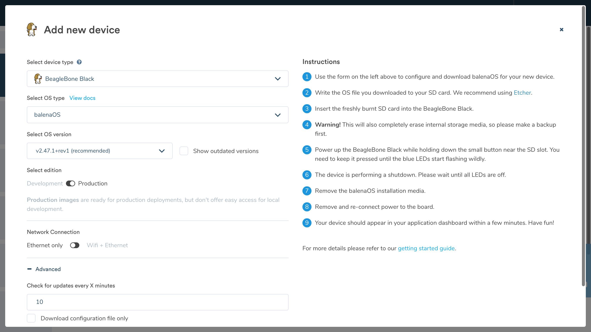

# Getting Started Helper Scripts

This WIP repo allows generating content for the Getting Started guide, including device-specific screenshots using Selenium.

> Note, this runs headless, and screenshots are captured at all points to try and find the point of failure if selectors are updated.



## Screenshots

To capture all screenshots for all devices, after installing dependencies in a virtual environment, and renaming
`config.sample` to `config.py` and adding in credentials, simply run:

```shell
python3 add_application.py
```

This script creates and deletes an application for each device, so will take a while to run (though it's much quicker than doing it manually!)

Screenshots are saved in the `/screenshots/` folder. The original screenshot is saved together with an edited version for the docs. The Pillow image library is used to edit the screenshots. These can then be exported to the relevant image folder in the docs repo.

> Note: This script will only work on a paid plan due to the available applications available and selectors would need to be updated for alternatives.

```shell
python3 cli_release.py
```

This script optionally generates the latest CLI installer screenshot and saves to `screenshots/cli/cli-release.png`.

## Device dictionary

```shell
python3 device_config.py
```

This script generates the device config file for the [docs](https://github.com/balena-io/docs/blob/master/config/dictionaries/device.json). It also includes the instructions for each board, which are optionally output if no custom content for each board is found. Instructions are formatted to work with Mustache templating.

## Known Issues

* There is a hack to use a massive viewport due the device dropdown (and not being selectable). I've tried various alternatives but this is the only thing I can get to currently work...
* Related to the above, I haven't yet found a clean way to count the devices in the dropdown, so it loops through until it hits an exception. It's currently catching a general exception, so this could be an error, or it has finished looping through devices. #TODO
* There are a couple of lengthy `sleep` statements. I tried (unsuccessfully) to use `ExplicitWait`, and adding this would greatly improve the speed of this as currently, the wait is likely very excessive. #TODO
* There is no way to easily generate a single image (other than to manually set the counter to the correct device). #TODO
* Would be nice to run it in a [Docker container](https://hub.docker.com/r/joyzoursky/python-chromedriver/)
